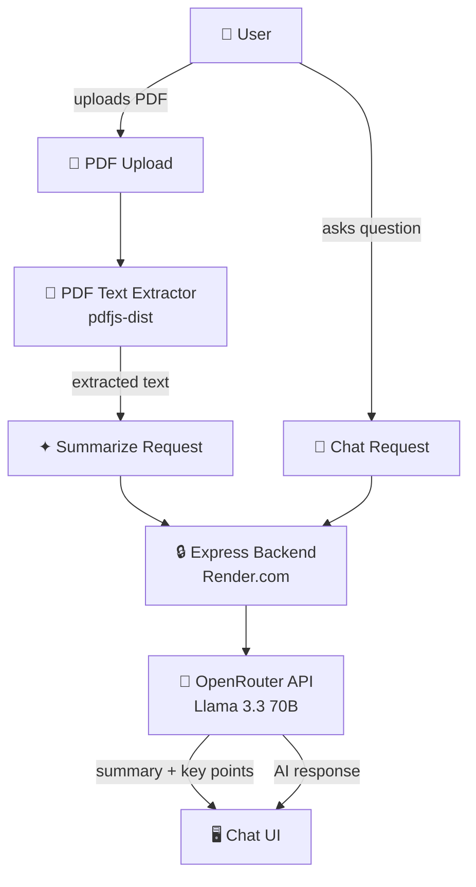

# DocSense — AI Document Intelligence Platform

An AI-powered document analysis web application that enables users to upload PDFs and interact with document content through a real-time chat interface. Built with React, TypeScript, and OpenRouter API with Llama 3.3 70B.

---

## Live Demo

🔗 **[doc-sense-mu.vercel.app](https://doc-sense-mu.vercel.app)**

---

## Features

- **PDF Upload** — Drag & drop or click to browse, supports up to 10MB
- **AI Document Summary** — Instantly generates a summary and key insights on upload
- **Interactive Chat** — Ask anything about the document in natural language
- **Multi-document support** — Switch between multiple uploaded documents
- **Suggestion chips** — Quick prompts to get started instantly
- **Secure API proxy** — API keys never exposed to the client via Express backend

---

## Tech Stack

| Layer | Technology |
|-------|------------|
| Frontend | React 18 + TypeScript |
| Styling | Tailwind CSS |
| AI API | OpenRouter API |
| LLM Model | Llama 3.3 70B Instruct |
| PDF Parsing | pdfjs-dist |
| Backend | Node.js + Express + tsx |
| Deployment | Vercel (frontend) + Render (backend) |

---

## Project Structure

```
DocSense/
├── server/
│   └── index.ts              # Express backend — OpenRouter API proxy
├── src/
│   ├── components/
│   │   ├── Sidebar.tsx        # Document list + upload zone
│   │   ├── ChatPanel.tsx      # Main chat interface
│   │   ├── ChatMessage.tsx    # Individual message bubble
│   │   └── SummaryCard.tsx    # AI summary + key insights card
│   ├── services/
│   │   ├── claudeApi.ts       # API call functions
│   │   └── pdfExtractor.ts    # PDF text extraction
│   ├── types/
│   │   └── index.ts           # Shared TypeScript interfaces
│   ├── App.tsx                # Root component + state management
│   └── main.tsx               # Entry point
├── public/
│   └── index.html
└── vite.config.ts
```

---

## How It Works



---

## Architecture Decisions

### Why OpenRouter?
OpenRouter provides a unified API across multiple LLM providers (Claude, GPT-4, Gemini, Llama). The model can be swapped without changing any application code — just update the model string.

### Why Express Backend?
The Express server acts as a secure proxy between the frontend and OpenRouter API. This keeps the API key server-side and never exposed to the browser.

### Why pdfjs-dist?
Client-side PDF parsing means no file uploads to a server — the PDF text is extracted in the browser and only the text is sent to the AI. Faster, cheaper, and more private.

---

## Getting Started

### Prerequisites
- Node.js 20+
- OpenRouter API key — get one at [openrouter.ai](https://openrouter.ai)

### Installation

```bash
# Clone the repo
git clone https://github.com/shubhamrathi-er/DocSense.git
cd DocSense

# Install frontend dependencies
npm install

# Install server dependencies
cd server && npm install && cd ..
```

### Environment Setup

Create `server/.env`:
```
OPENROUTER_API_KEY=sk-or-your-key-here
```

### Running Locally

```bash
# Terminal 1 — Frontend (http://localhost:5173)
npm run dev

# Terminal 2 — Backend (http://localhost:3001)
cd server && npm run dev
```

Visit **http://localhost:5173**, upload a PDF and start chatting.

---

## Deployment

- **Frontend** — Vercel (auto-deploys on push to main)
- **Backend** — Render (auto-deploys on push to main)

Add `OPENROUTER_API_KEY` in Render → Environment Variables.

---

## Author

**Shubham Rathi** — Senior Frontend Engineer
[LinkedIn](https://linkedin.com/in/shubham-rathi-7480891aa) · [GitHub](https://github.com/shubhamrathi-er/DocSense)